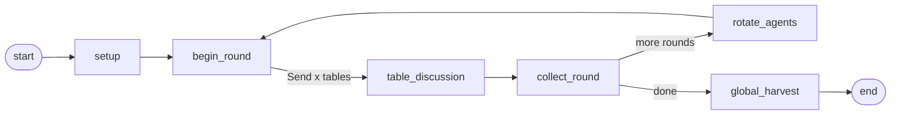

# Agent Cafe

这是一个基于 LangGraph 的“世界咖啡”多 agent 编排骨架。用户只需要输入每张桌子的初始问题，就可以启动多张桌子的并行讨论。agent 画像可以稍后通过 YAML 替换。

## 为什么用 LangGraph

这个场景不是单轮链式调用，而是有状态、有阶段、有并行分支、有循环轮换的工作流。LangGraph 的 `StateGraph` 适合表达阶段控制，`Send` 适合把每张桌子的讨论并行 fan-out，再回收成全局状态；LangSmith / LangGraph streaming 可以进一步承接运行过程 trace。

核心流程：



## 快速运行

安装依赖：

```powershell
uv sync --extra dev
```

先填写 `.env`：

```powershell
notepad .env
```

只需要把 `OPENAI_API_KEY` 填进去；`OPENAI_BASE_URL` 和模型默认已经按当前 OpenAI-compatible 接口配置好。

启动前端工作台：

```powershell
uv run world-cafe-web --host 127.0.0.1 --port 8000
```

然后打开 <http://127.0.0.1:8000>。前端包含用户聊天窗口、facilitate 拆题、多桌讨论过程、每轮 agent 发言、桌长记录和最终 harvest。
桌数、每桌发言人数、轮数和每人发言次数可以在页面中调整；facilitate 会按当前桌数拆题，开始前也可以在每张桌子下方多选初始可发言 agent。桌长仍然只记录、不发言。
每个 round 按“每人发言次数”控制讨论长度；发言 agent 每次输出限制为 300 字，前端按 cycle / turn 展示。

不调用真实大模型的 dry run：

```powershell
uv run world-cafe --dry-run --questions `
  "AI 如何帮助社区共创？" `
  "老龄友好服务该怎么设计？" `
  "校园空间怎样支持跨学科学习？" `
  "城市更新如何纳入居民声音？"
```

调用真实 OpenAI-compatible API：

```powershell
$env:OPENAI_API_KEY="your-token"
$env:OPENAI_BASE_URL="http://143.198.222.179:8317/v1"
$env:OPENAI_MODEL="gpt-5.5"
uv run world-cafe --questions `
  "AI 如何帮助社区共创？" `
  "老龄友好服务该怎么设计？" `
  "校园空间怎样支持跨学科学习？" `
  "城市更新如何纳入居民声音？"
```

结果会写入 `runs/<run_id>.md` 和 `runs/<run_id>.trace.json`。

## Agent 画像

复制 `config/agents.example.yaml`，把每个 agent 的 `role`、`skills`、`style` 替换成你的画像：

```powershell
Copy-Item config/agents.example.yaml config/agents.yaml
uv run world-cafe --dry-run --agents-file config/agents.yaml --questions `
  "问题1" "问题2" "问题3" "问题4"
```

默认规则：

- 默认 4 张桌子，每桌 3 个发言 agent 加 1 个桌长；前端可调整桌数和每桌发言人数。
- 每桌第 1 个 agent 为桌长，桌长不轮换。
- 每轮结束后，非桌长 agent 顺时针轮换到下一桌。
- 每张桌子保留独立桌长记忆：核心洞察、开放问题、张力、每轮摘要。
- 最后一轮结束后执行全局 harvest。

前四个默认发言 agent 已替换为专家 skill 画像：

- `agent_01` / Prof.Lou：娄永琪视角智能体。
- `agent_02` / 萌学长：王萌视角智能体。
- `agent_03` / 胧老师：刘胧视角智能体。
- `agent_04` / 受之老师：王受之视角智能体。

## Trace

本地 trace 默认开启，记录阶段、轮次、桌子、agent 分配与 harvest。需要 LangSmith 时设置：

```powershell
$env:LANGSMITH_TRACING="true"
$env:LANGSMITH_API_KEY="your-langsmith-key"
```

CLI 也支持流式查看阶段事件：

```powershell
uv run world-cafe --dry-run --stream --questions "问题1" "问题2" "问题3" "问题4"
```
